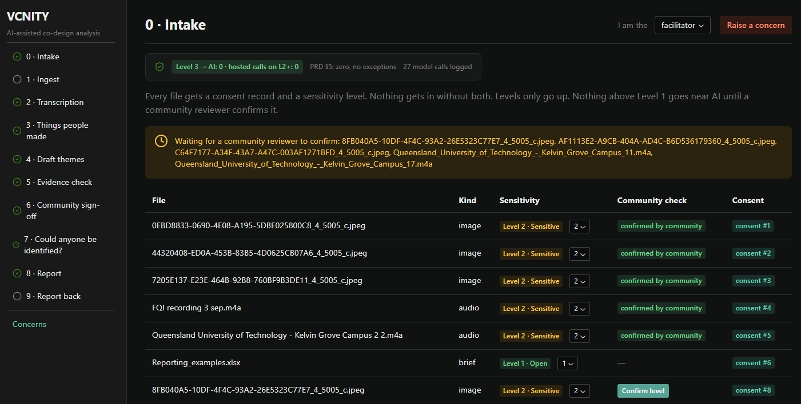

# VCNITY Prototype

This is a prototype application of AI-assisted data pipeline that turns community creative Co-Design materials, such as multi-speaker audio, code-switched languages, local slang, photos of handmade artefacts into policy-ready themes, without letting AI distort or override the community's say. Everything runs on your local PC — nothing is sent to the cloud.

The Main Dashboard:



## Preparation for Installation

You'll need:

1. [uv](https://docs.astral.sh/uv/) installed and on your PATH.
2. [Ollama](https://ollama.com) is installed and running, with the two models below pulled. If your machine has 16GB RAM and no GPU, that's fine — the app never loads both models at once.
3. To process audio files, a free HuggingFace token needs to be configured. You need to add your token `HF_TOKEN=hf_…` to `app/.env`. Without it, the transcription can still work, but without speaker labels to separate them.

Pull these two open-source Qwen models from Ollama:

```
ollama pull qwen3.5:4b    # text model for evidence checks and reporting
ollama pull qwen3-vl:4b   # vision model for preprocessing image artefacts
```

## Install and run

```
git clone https://github.com/maverick001/vcnity.git
cd vcnity
cp app/.env.example app/.env         # add your Hugging Face Token to fetch the model file
python app/start.py                  # installs dependencies, starts the database, API, and UI
```

Open http://localhost:3000 once the app is running.

The first run on your PC will download about 2 GB of Python packages, plus a 3 GB speech-recognition model the first time you transcribe something, and a small multilingual embedding model (used to group material into draft themes) the first time you draft themes. None of this is stored in the project folder — it all lives in `~/.vcnity/`, so the repo itself stays small.

## Speeding up transcription (Optional)

Transcribing a recording can take about an hour on a laptop CPU. Rather than wait for that live, you can pre-run the whole pipeline ahead of time:

```
uv run --project app python app/scripts/precompute.py --confirm-levels --demo-signoff
```

This does two things: `--confirm-levels` confirms each file's sensitivity level for you (normally a community reviewer's job, and AI stages won't run without it), and `--demo-signoff` fills in the sign-off, identifiability, and report stages with clearly-labelled placeholder decisions. The result: every page in the app has something to look at, without anyone having done that review for real yet.

Once you're ready to do that review for real, clear the placeholders first:

```
uv run --project app python app/scripts/precompute.py --job 1 --reset-signoff
```

## Using the app

You can switch your roles on the selector in the top right — the app behaves differently depending on whether you're the facilitator, the community, or the analyst. The stage list on the left shows what's been completed.

The pipeline runs through: **Intake** (upload files, set a sensitivity level and consent) → **Transcription** → **Things people made** (photos and objects) → **Draft themes** → **Sign-off** (community and analyst review) → **Could anyone be identified?** → **Report** → **Report back**. You can also raise a concern from any page.

A couple of things worth knowing while you use it: role selection is just a dropdown (there's no login — this is a proof of concept), and sensitive material never reaches the AI until the community has confirmed its level.
