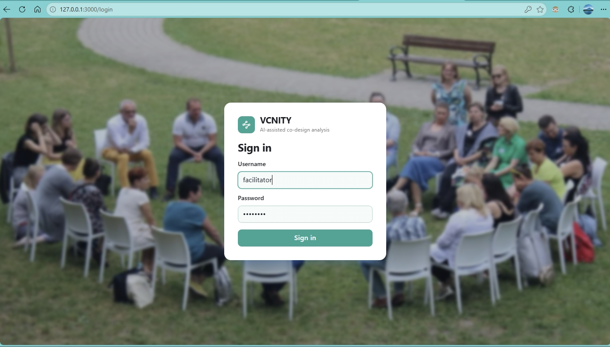
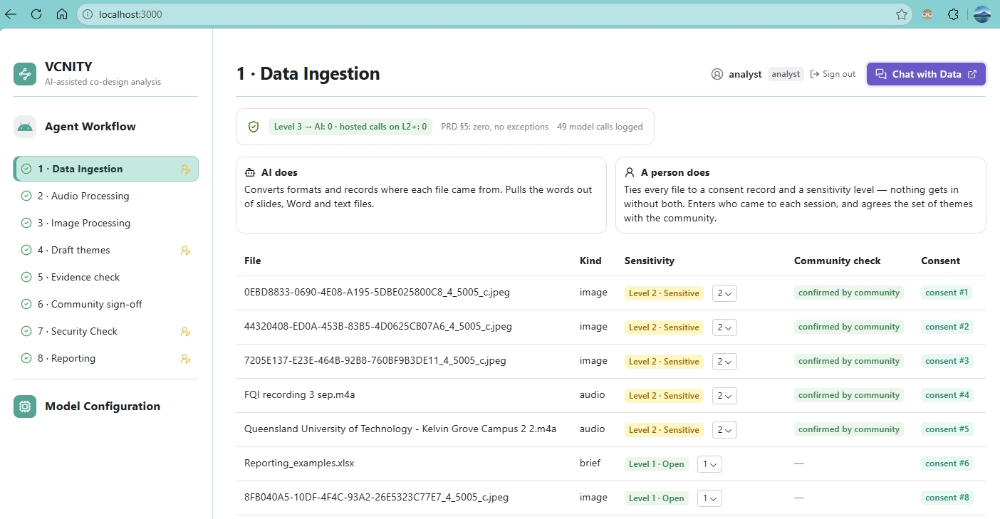

# VCNITY Community App

This is a prototype application of GenAI-assisted data pipeline that automates community creative Co-Design without letting AI distort or override the community's say. All the data runs on your local PC — nothing is sent to the cloud.


## Preparation for Installation

You'll need:

1. [uv](https://docs.astral.sh/uv/) installed and on your PATH.
2. [Ollama](https://ollama.com) is installed and running, with the two models below pulled. If your machine has 16GB RAM and no GPU, that's fine — the app never loads both models at once.
3. To process audio files, a free HuggingFace token needs to be configured. You need to add your token `HF_TOKEN=hf_…` to `.env`. Without it, the transcription can still work, but without speaker labels to separate them.

Pull these two open-source Qwen models from Ollama:

```
ollama pull qwen3.5:4b    # text model: finds names, labels themes, evidence checks, reports
ollama pull qwen3-vl:4b   # vision model for preprocessing image artefacts
```

## 

## Install and run

```
git clone https://github.com/maverick001/VCNITY.git
cd VCNITY
cp .env.example .env    # add your Hugging Face Token to fetch the model file
python start.py         # installs dependencies, starts the database, API, and UI
```

The first run on your PC will download about 1 GB of Python libraries, plus a 3 GB speech-recognition ML model the first time you transcribe something, and a small multilingual embedding model (for grouping raw data into draft themes). None of this is stored in the project folder — it all lives in your `~/.vcnity/`.

Once app is installed and running, open http://localhost:3000 and sign in with one of the four roles.

On the sign-in page, every user can sign in with an account as facilitator, analyst, community member or council member.



### 

## Authentication

Everyone signs in. There's no sign-up page: make accounts from the command line, while the app is running or not.

```
uv run python scripts/users.py demo                       # one account per role; prints each password once, so write them down
uv run python scripts/users.py add sam community --job 1  # your own account; asks for a password
uv run python scripts/users.py list
uv run python scripts/users.py password sam               # reset a password
```

`demo` makes these four accounts, with the role name as the username. A community or client account belongs to one job, so `demo` only makes them once a job exists: create one as the facilitator, then run `demo` again.

| Username      | Role             | Who they are                                                                            |
| ------------- | ---------------- | --------------------------------------------------------------------------------------- |
| `facilitator` | Facilitator      | Meets community members, collects the raw data, uploads it and labels it                |
| `analyst`     | Data Analyst     | Processes the raw data, runs the stages, picks the models and produces the report       |
| `community`   | Community Member | Reviews the labels and themes, says what things mean, signs off and approves the report |
| `client`      | Client           | Reads the report once the community and the analyst have approved it                    |

## 

## Using the app

The Main Panel



After signing in, you land on your own panel page. Each step below says which role does it. The sidebar lists the stages in order (the analyst sees all of 1–8; the facilitator sees only 1 and 2, because their job is to bring material in and pass things between the analyst and the community and client); a green tick means that stage has output, and an amber person icon means it's waiting for someone (hover to see what for). You run a stage with **Run** on the **Workflow** page, or the re-run button on that stage's own page — only the analyst can. The facilitator never runs stages or resets a job, and never sees stages 3–8: the Workflow overview, the artefacts, themes and sign-off, the made-up names list, the identifiability flags, the evidence check or the report.

The **community** and the **client** don't see the sidebar or the stage pages. Signing in as either takes you to a page of their own. The community page (`/community`) is one plain-language page with everything a community reviewer does: check each file's label (with a preview of the file), agree themes and the word list, say what each made thing means, sign off the themes, and approve the report. It shows only the quotes behind each theme, plus a search when adding one we missed — never a full transcript. The client page (`/client`) shows the report once both approvals are in, and nothing else.

A job, step by step:

1. **Data Ingest** (facilitator and community, *1 · Data Ingest*).
   - **Upload** (facilitator). Create a job and upload recordings, photos, Word/PowerPoint/text files and the client's spreadsheet. Give each file a consent label and a sensitivity level; if unsure, go up a level. The facilitator can change a level later, up or down; the analyst can only raise one. After any change, a Level 2 file needs the community to confirm it again.
   - **Who came** (facilitator). Enter how many people came to each session. The total is the "M" in the report's "N of M participants".
   - **Confirm levels and agree themes** (community, under *Check the labels* and *Our words*). Confirm every Level 2 file's level (no AI runs on it until then) and add the themes to sort into.
   - Press **Run** on stage 1 on the **Workflow** page to convert the files (no AI). Do this even with no audio; later stages read the converted files.
2. **Word list and transcripts** (facilitator and analyst, *2 · Audio Processing*). Add names, slang and place words to the word list (`@person` after a person's name), then run stage 2. If a recording has no speakers identified, an amber warning shows; the analyst can re-run stage 2 (speaker labels need the HuggingFace token). To measure the word list, paste a corrected transcript and press **Compute WER**.
3. **Things people made** (community and analyst, *3 · Image Processing*). Run stage 3, then type what each maker said their piece means. The AI never guesses that.
4. **Check names, then sort** (analyst, *4 · Draft themes*). Run stage 4. With Level 2 material it stops: add any real name that slipped through, remove anything that isn't a name, press **Names are right** on each file, then run stage 4 again to sort.
5. **Check the evidence** (analyst, *5 · Evidence check*, same page as stage 4). Run stage 5. A theme that claims more than its quotes say is marked *unsupported* and never reaches sign-off.
6. **Sign off** (community, *What we heard*). Confirm, fix or reject each theme and add any we missed. Switch on *This comes from Restricted material* for a theme from material only people have seen; it reaches the client with no quotes.
7. **Count and check** (analyst, *7 · Security Check*). Type the number of people behind each theme, run stage 7, then keep or cut every flag and write down why.
8. **Report** (community and analyst, *8 · Reporting*). Run stage 8. The community (under *The report*) and the analyst both approve, then export it as a Word file.


## Features

**1. Chat with Data** (facilitator or analyst, the violet button top right on any page). Opens a chat in its own browser tab where you can ask about the current job's material — "where did people talk about parking?", "what did the second recording say about the carpark?". A local model answers only from the material below Level 3 and lists the passages it used; Level 2 names may show as made-up stand-ins. It won't say what anything means — that's the community's call at sign-off. Answers can take up to a minute, the chat is blocked while a stage is running, and nothing is kept after you reload the page.

**2. Model Configuration** (analyst only, *Model Configuration* at the bottom of the sidebar). The Hugging Face, Ollama and Kaggle logos beside the heading are decoration; they show where local models come from. Pick which model each step uses for the current job: audio processing, image processing, draft themes, evidence check, security check and reporting. Each model shows its parameter count, where it came from and its size on disk, e.g. `faster-whisper-large-v3 (1.55B) · Systran · 3.1 GB`. Only models already on this laptop are listed — speech models in `~/.vcnity/cache/models`, text and vision models from Ollama. A model you `ollama pull` shows up the next time you open or reload the page, no code change; Ollama says whether it reads images, which decides the steps it's offered for. A new speech model gets downloaded the first time stage 2 runs with it set as `VCNITY_ASR_MODEL` in `.env`. A pick applies to that job only; anything a step has already made stays until you re-run it. Without a pick, a step uses the defaults in `.env`. Nobody else sees the page or which models are in use.

## License

© 2026 Kevin Bai. All rights reserved. This code is published for viewing only: no permission is granted to copy, modify or redistribute it.
