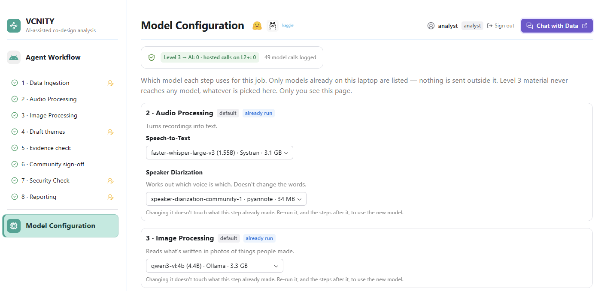

# VCNITY Community App

This is a prototype application of GenAI-assisted agentic workflow that automates community creative Co-Design. All data is processed on your local PC with open source models, nothing goes to the cloud without approval.

## Preparation for Installation

You'll need:

1. [uv](https://docs.astral.sh/uv/) installed and on your PATH.
2. [Ollama](https://ollama.com) is installed and running, with the two models below pulled. If your machine has 16GB RAM and no GPU, that's fine — the app never loads both models at once.
3. To process audio files, a free HuggingFace token needs to be configured. You need to add your token `HF_TOKEN=hf_…` to `.env`. Without it, the transcription can still work, but without speaker labels to separate them. The speaker models are downloaded once with this token, then run fully on your PC.

Pull these two open-source Qwen models from Ollama:

```
ollama pull qwen3.5:4b    # text model: finds names, labels themes, evidence checks, reports
ollama pull qwen3-vl:4b   # vision model for preprocessing image artefacts
```

## Install and run

```
git clone https://github.com/maverick001/VCNITY.git
cd VCNITY
cp .env.example .env    # configure your Hugging Face Token here
python start.py         # installs Python dependencies, starts the database, API, and UI
```

The first-time running of the app will download about 1 GB of Python libraries, plus 3 GB of speech-recognition models and a small multilingual embedding model (for grouping raw data into draft themes). The model files will be saved to your local dir `~/.vcnity/`.

Once app is installed and running on your local PC, open http://127.0.0.1:3000 in your browser and sign in with one of the four roles.

On the sign-in page, every user can sign in with an account as facilitator, analyst, community member or council member.


## Authentication

There are 4 types of user who use this platform.  Their user names and roles are listed below. Username can be used as account to login to the platform.

| Username          | Role             | Responsibilities                                                                        |
| ----------------- | ---------------- | --------------------------------------------------------------------------------------- |
| `facilitator`     | Facilitator      | Meets community members, collects the raw data, uploads it and labels it                |
| `analyst`         | Data Analyst     | Processes the raw data, runs the stages, picks the models and produces the report       |
| `communitymember` | Community Member | Reviews the labels and themes, says what things mean, signs off and approves the report |
| `councilmember`   | Client           | Reads the report once the community and the analyst have approved it                    |

## Using the app

### Data Analyst Panel


After signing in, you will land on to your own panel page. The agent workflow on the left sidebar demostrates how the app works. The green tick means that stage has output, and an amber person icon means it's pending human input. A **facilitator** can upload raw data files and input complementary information on the Facilitator panel. An analyst can run a single stage with **Run** on the **Agent Workflow** page, or use the **Reset job** button to rerun the whole workflow.

The **community member** and the **client (council member)** don't see the sidebar or the stage pages. Signing in as either takes you to a page of their own. The community page (`/community`) is one plain-language page with everything a community reviewer does: check each file's label (with a preview of the file), agree themes and the word list, sign off the themes, and approve the report. It shows only the quotes behind each theme, plus a search when adding one we missed — never a full transcript. The client page (`/client`) shows the report once both approvals are in, and nothing else.

Run workflow step by step:

1. **Data Ingestion** (facilitator and community): upload the files with a consent label and sensitivity level, then run stage 1.
2. **Audio Processing** (facilitator and analyst): add names and slang to the word list, then run stage 2 to get transcripts with speaker labels.
3. **Image Processing** (community and analyst): run stage 3, then type what each maker said their piece means.
4. **Draft themes** (analyst): check the names, then run stage 4 to sort quotes into themes.
5. **Evidence check** (analyst): run stage 5 to mark any theme its quotes don't support.
6. **Community sign-off** (community): confirm, fix or reject each theme.
7. **Security Check** (analyst): run stage 7, then keep or cut each flag.
8. **Reporting** (community and analyst): run stage 8, approve the report, and export it as Word.

## Key Features

**1. Chat with Data** (in Facilitator and Analyst Panels). Opens a chat in its own browser tab where you can ask about the current job's material — "where did people talk about parking?", "what did the second recording say about the carpark?". A local model answers only from the material below Level 3 and lists the passages it used; Level 2 names may show as made-up stand-ins. It won't say what anything means — that's the community's call at sign-off. Answers can take up to a minute, the chat is blocked while a stage is running, and nothing is kept after you reload the page.

**2. Model Configuration** (in Analyst Panel only). Here the analyst picks the local model each step uses for the current job.



Audio processing has two options: **Speech-to-Text** (Whisper, which writes the words) and **Speaker Diarization** (works out which voice is which, and doesn't change the words). Each model shows its parameter count, where it came from and its size on disk, e.g. `faster-whisper-large-v3 (1.55B) · Systran · 3.1 GB`. Only models already on this laptop are listed — speech models in `~/.vcnity/cache/models`, speaker models in the Hugging Face cache, text and vision models from Ollama. The selected model applies to that job only; anything a step has already made stays until you re-run it. Without a pick, a step uses the defaults in `.env`. Nobody else sees the page or which models are in use.

## License

© 2026 Kevin Bai. All rights reserved.
